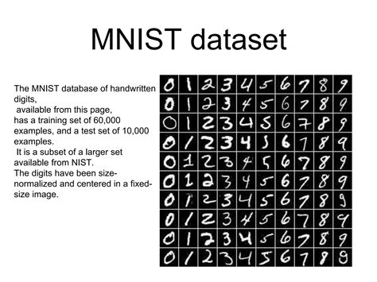
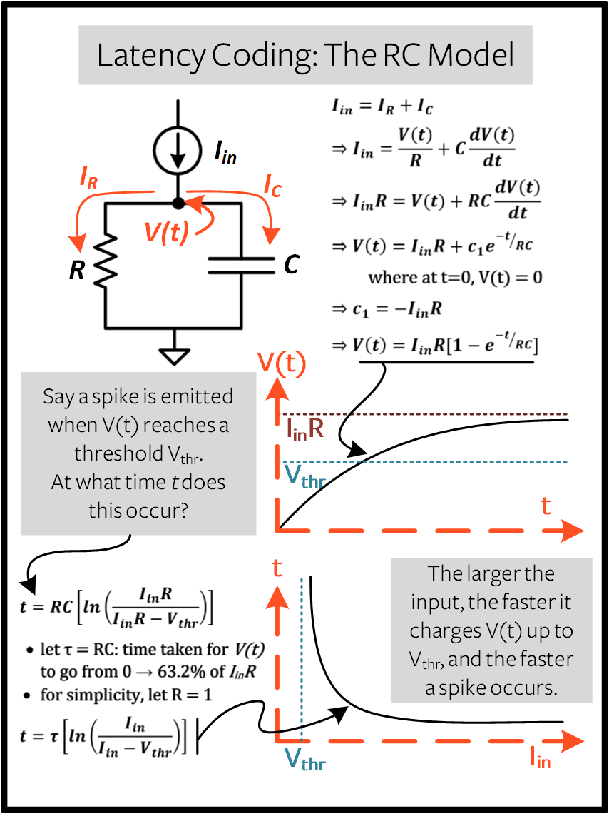
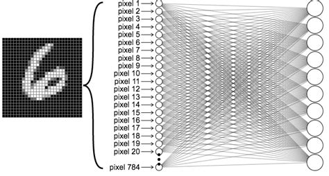
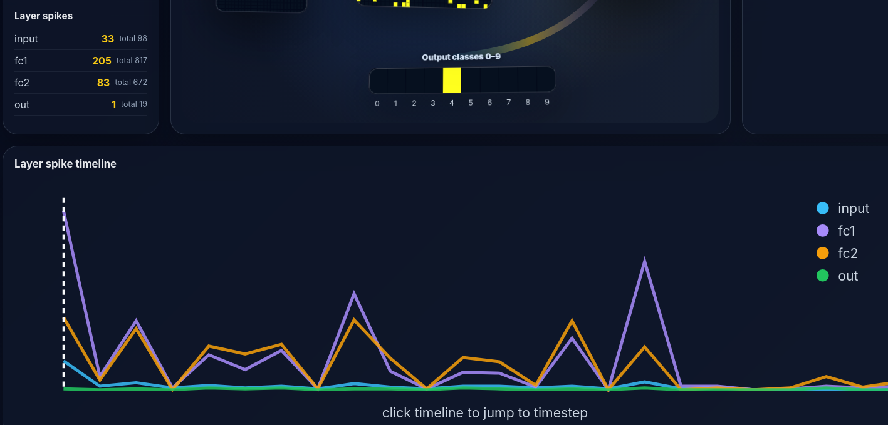
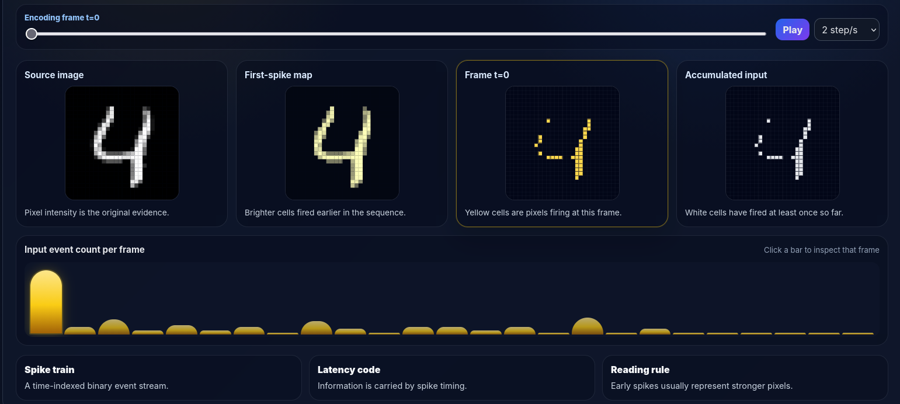
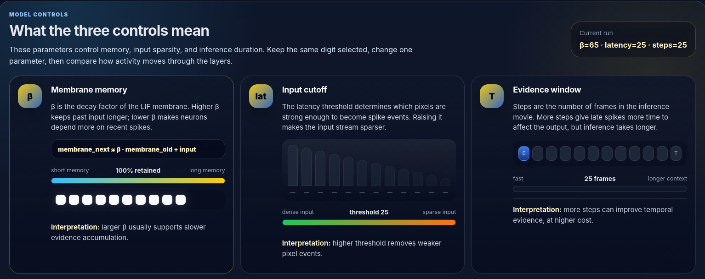

# SpikeLens: Interactive Visualization of Spiking Neural Network Inference

**Big Data Visualization and Visual Analysis Final Project**

SpikeLens is an interactive static web application for visualizing how a spiking neural network transforms a latency-coded MNIST digit into a class decision over time. Instead of treating neural network inference as a single final prediction, the project opens the inference process and represents it as a short temporal sequence of input spikes, hidden-layer spike activity, membrane potentials, and output-class evidence.

**Live site:** `https://c1truus.github.io/spikelens_bdva/`  
**Repository:** `https://github.com/c1truus/spikelens_bdva`

> Figure placeholder: main SpikeLens web interface screenshot.  
> Add image: `docs/images/spikelens_main_interface.png`

---

## 1. Project Overview

### 1.1 Abstract

SpikeLens visualizes the inference dynamics of a spiking neural network trained on MNIST digit classification. The project converts static handwritten digit images into spike trains using latency encoding, runs inference through a feed-forward spiking neural network, records the spike and membrane state of each layer over time, and presents the result as an interactive browser-based visualization.

The final website allows the viewer to compare multiple trained model variants, change the selected hyperparameters, choose input samples, scrub through timesteps, play the inference sequence as a short animation, inspect spike counts, and read guided explanations of the encoding and model parameters.

The project is intentionally designed as a static website. The neural network is not executed in the browser. Instead, the expensive training and inference recording are performed offline using Python and snnTorch, then exported into JSON trace files. The frontend loads those files directly from GitHub Pages.

### 1.2 Core Visualization Question

The central visualization question is:

> How does a spiking neural network accumulate temporal evidence from a latency-coded handwritten digit, and how do model hyperparameters affect the visible propagation of spikes and membrane potentials through the network?

This question is different from simply asking whether the model predicts the correct digit. The goal is to visualize the hidden temporal process that leads to the classification result.

### 1.3 Final Outcome

The project produces:

- A trained set of SNN model variants.
- Exported inference traces containing spike events and membrane potentials.
- A manifest-based static data structure for browser loading.
- A Svelte/Vite web application hosted with GitHub Pages.
- A visual interface showing:
  - input spikes,
  - hidden-layer activity,
  - membrane potential intensity,
  - output spike accumulation,
  - timestep playback,
  - latency encoding explanation,
  - hyperparameter explanation.

---

## 2. Motivation and Idea Development

### 2.1 Initial Idea

The original idea came from my bachelor's graduation thesis : implementing a Spiking Neural Network (SNN) accelerator on FPGA. That project already involved reasoning about spike events, timestep-based inference, latency encoding, and layer-wise neuron activity. This made it a natural candidate for a visualization project.

A normal artificial neural network usually appears as a static mapping:

```text
input image → output class
````

A spiking neural network is more naturally temporal:

```text
input image → spike sequence → layer activity over time → output spike counts
```

This temporal structure creates a stronger visualization opportunity.

### 2.2 Why SNN Inference Needs Visualization

Spiking neural networks are not only defined by final activations. They operate through discrete spike events and internal membrane states. A neuron may remain silent for many timesteps, accumulate membrane potential, and then emit a binary spike only when the threshold is crossed.

This means that useful information exists at several levels:

* Which input pixels spike early?
* Which hidden neurons become active?
* How sparse is the activity?
* Which output neuron accumulates the most spikes?
* How do hyperparameters change the dynamics?

These questions are difficult to answer from a normal accuracy number or static confusion matrix. SpikeLens turns the inference sequence into an inspectable visual object.

### 2.3 Why a Static Web App

A live Python backend would allow real-time model inference, but it would make deployment more complex. For a final course project, the priority was to create a reliable, shareable, and visually polished interactive system.

Therefore, SpikeLens uses this design:

```text
Offline training and trace export
        ↓
JSON trace dataset
        ↓
Static Svelte/Vite web app
        ↓
GitHub Pages deployment
```

The browser only loads precomputed data. This makes the final project easy to open, easy to grade, and independent of local Python, PyTorch, CUDA, or snnTorch installations.

### 2.4 Main Design Constraints

The project had several practical constraints:

* The website should run without a backend.
* The dataset must be small enough for GitHub Pages.
* The visualization must remain readable despite hundreds or thousands of neurons.
* The interaction should be simple enough for a first-time viewer.
* The project should explain SNN concepts, not only display them.

---

## 3. Background

### 3.1 MNIST Dataset

MNIST is a handwritten digit classification dataset. Each input sample is a 28×28 grayscale image representing a digit from 0 to 9. The standard dataset contains 60,000 training images and 10,000 test images.

SpikeLens uses MNIST because it is visually intuitive. A reader can immediately recognize the digit and compare it with the network prediction. The 28×28 input size also maps naturally to a 28×28 grid, which is ideal for visualizing input spikes.



### 3.2 Spiking Neural Networks

A spiking neural network represents information using discrete spike events over time. Instead of every neuron producing a continuous activation value at once, neurons emit binary spikes at particular timesteps.

In a simplified view:

```text
standard neural network:
continuous activation values

spiking neural network:
binary events across discrete time
```

This makes the network more biologically inspired and temporally structured. For visualization, this is useful because inference becomes a short sequence rather than a single static computation.

### 3.3 Leaky Integrate-and-Fire Neurons

SpikeLens uses leaky integrate-and-fire behavior through snnTorch. A leaky neuron maintains a membrane potential. Incoming current increases the membrane potential, while a decay factor reduces the stored potential over time. If the membrane crosses a threshold, the neuron emits a spike.

The main intuition is:

```text
input current arrives
        ↓
membrane potential accumulates
        ↓
old potential decays by beta
        ↓
threshold crossing produces a spike
```

In this project, the membrane state is visualized as intensity. In membrane mode, darker cells represent lower membrane values and brighter cells represent stronger membrane states.

### 3.4 Latency Encoding

MNIST images are static, but SNNs operate over time. To feed images into the SNN, the project uses latency encoding.

Latency encoding converts pixel brightness into spike timing:

* Bright pixels spike earlier.
* Darker pixels spike later.
* Very weak pixels may not spike.
* One image becomes a short temporal sequence of input spike frames.

For example, a bright stroke pixel in the digit may spike at timestep 0 or 1, while a dim antialiased edge pixel may spike later. This creates a sparse temporal input stream from a static image.



### 3.5 Spike Train

A spike train is a sequence of binary events over time. For one neuron:

```text
timestep: 0 1 2 3 4 5 ...
spike:    1 0 0 1 0 0 ...
```

For the MNIST input layer, there are 784 input neurons, one for each pixel. Therefore, one encoded image becomes 784 small spike trains.

### 3.6 Hyperparameters Used

SpikeLens exposes three main hyperparameters:

#### Beta

Beta controls membrane memory. A higher beta means the neuron remembers more previous membrane potential. A lower beta means the membrane decays faster.

Human interpretation:

```text
low beta  → short memory
high beta → longer memory
```

#### Latency Threshold

Latency threshold controls which input pixel intensities are strong enough to become spikes. A stricter threshold removes weak pixels and creates a sparser input sequence.

Human interpretation:

```text
low threshold  → more pixels can spike
high threshold → fewer, stronger pixels spike
```

#### Inference Timesteps

Inference timesteps control how many frames the SNN receives before making a decision. More timesteps give the model a longer evidence window, but also create a longer visualization sequence.

Human interpretation:

```text
fewer steps → faster but shorter evidence window
more steps  → slower but more temporal evidence
```

---

## 4. Data Visualization Question

### 4.1 Main Question

The main question is:

> How does latency-coded visual evidence propagate through a spiking neural network over time?

The project focuses on visualizing the process, not only the result.

### 4.2 Subquestions

SpikeLens is designed to help answer:

1. Which pixels of the input digit spike early?
2. How sparse is the input spike train?
3. How does hidden-layer activity change over time?
4. Which class neuron accumulates output spikes?
5. Does the correct class dominate early or late?
6. How do beta, latency threshold, and timestep count affect visible dynamics?
7. How can a dense neural process be represented without drawing every synapse?

### 4.3 Why Static Plots Are Not Enough

A normal matplotlib plot can show one frame or one summary statistic, but it does not provide a strong interactive experience for temporal inference. The viewer needs to move through timesteps, compare different model settings, choose samples, and inspect layers together.

SpikeLens uses a web interface because the project benefits from:

* playback,
* scrubbing,
* dropdown controls,
* clickable timeline,
* coordinated views,
* explanatory sections,
* shareable deployment.

### 4.4 Visual Abstraction Strategy

A fully connected network contains too many synapses to draw clearly. The actual model includes large dense connections between layers. Drawing all edges would create visual clutter and would not help the reader understand the temporal dynamics.

Instead, SpikeLens abstracts each layer as a grid:

```text
Input layer:      28 × 28
Hidden layer 1:   32 × 32
Hidden layer 2:   16 × 16
Output layer:      1 × 10
```

This keeps the actual neuron count visible while avoiding unreadable edge clutter.



---

## 5. Model and Data Generation

### 5.1 Network Topology

The model topology used for the published visualization is:

```text
784 → 1024 → 256 → 10
```

This maps naturally to the visualization layout:

| Layer            | Size | Visualization  |
| ---------------- | ---: | -------------- |
| Input            |  784 | 28×28 grid     |
| FC1 hidden layer | 1024 | 32×32 grid     |
| FC2 hidden layer |  256 | 16×16 grid     |
| Output           |   10 | 10 class cells |

The 1024 and 256 hidden sizes were selected because they form square grids. This makes the visualization more legible than using a non-square hidden size such as 512.

### 5.2 Hyperparameter Sweep

The model variants were trained across combinations of:

```text
beta:              0.65, 0.75, 0.85, 0.95
latency threshold: 0.15, 0.25, 0.35
timesteps:         25, 40, 60
```

This gives:

```text
4 × 3 × 3 = 36 model variants
```

This is large enough to support comparison, but small enough to keep the web interface manageable.

### 5.3 Training Pipeline

Training was performed offline in Python using PyTorch and snnTorch. The training notebook performs the following steps:

1. Load MNIST.
2. Define the SNN model.
3. Encode input images into spike trains.
4. Train each model variant for a fixed number of epochs.
5. Evaluate each model on the test set.
6. Save:

   * model checkpoint,
   * model state dictionary,
   * training history,
   * metadata,
   * completion marker.

The training artifacts are useful for reproducibility, but they are not required by the deployed website.

### 5.4 Evaluation Pipeline

Each model variant is evaluated after training. The evaluation records classification behavior such as predicted class and correctness. This is useful because the web interface can display whether the selected trace is correct or incorrect.

The final website does not run model evaluation live. Instead, it reads evaluation information embedded in the exported trace files and manifest.

### 5.5 Trace Export Pipeline

After training, a second notebook loads each trained model and records inference traces for selected MNIST test samples.

For each selected sample, the export pipeline records:

* original image,
* true label,
* predicted label,
* correctness,
* input spike frames,
* FC1 spike frames,
* FC2 spike frames,
* output spike frames,
* membrane potentials,
* per-layer spike counts,
* output spike accumulation,
* metadata such as beta, latency threshold, and timestep count.

This exported trace is the main dataset used by the web app.

### 5.6 JSON Trace Structure

Each exported sample is saved as a JSON file under:

```text
spikelens_webapp/public/data/traces/<model_id>/<sample>.json
```

A simplified trace contains:

```json
{
  "sample_idx": 0,
  "true_label": 7,
  "pred_label": 7,
  "correct": true,
  "num_steps": 25,
  "beta": 0.65,
  "latency_threshold": 0.15,
  "original_image": [...],
  "spikes_dense": {
    "input": [...],
    "fc1": [...],
    "fc2": [...],
    "out": [...]
  },
  "membrane": {
    "fc1": [...],
    "fc2": [...],
    "out": [...]
  },
  "output_spike_counts": [...]
}
```

The exact JSON is larger because it stores full timestep-by-layer arrays.

### 5.7 Manifest File

The web app needs a way to discover available models and samples. Since GitHub Pages is static hosting, the browser cannot list directories dynamically. Therefore, the export workflow creates:

```text
spikelens_webapp/public/data/manifest.json
```

The manifest lists:

* available model variants,
* hyperparameters for each model,
* sample file paths,
* labels and predictions,
* sample counts,
* correctness counts.

The app first loads the manifest, then fetches the selected trace JSON file.

### 5.8 Dataset Reduction for Deployment

The full local trace dataset can become very large. Dense membrane arrays make each JSON file several megabytes. Publishing all models and many samples would exceed practical GitHub Pages limits.

Therefore, the deployed version uses a reduced subset:

```text
36 model variants × 5 samples per model = 180 traces
```

This keeps the website interactive and deployable while preserving enough variety for comparison.

---

## 6. Visualization Design

### 6.1 Main Network View

The main visualization shows the SNN as a layer-by-layer spatial layout:

```text
Input 28×28 → FC1 32×32 → FC2 16×16 → Output classes 0–9
```

The layers are arranged as an isometric-style composition rather than a strict mathematical diagram. This makes the network feel like a temporal system while still keeping the layer structure readable.

~[Network trace view](./docs/images/network-trace.png)

### 6.2 Input Layer

The input layer shows the current latency-coded spike frame. Yellow or bright cells indicate pixels that spike at the selected timestep.

This view answers:

* Which parts of the digit fire early?
* How sparse is the input at the current timestep?
* Which pixels contribute to the temporal input stream?

### 6.3 Hidden Layers

The hidden layers are shown as grids:

```text
FC1: 32×32
FC2: 16×16
```

This spatial arrangement is not a physical layout of the model weights. It is a visual indexing method. Neuron IDs are mapped into square grids to make activity patterns readable.

### 6.4 Output Layer

The output layer is shown as 10 cells, one for each digit class. The output decision chart also shows cumulative output spikes up to the current timestep.

The predicted class is the output neuron with the largest spike count.

### 6.5 Color Modes

SpikeLens includes three layer coloring modes:

#### Spike mode

Shows binary spike events at the current timestep.

Use this mode to answer:

```text
Which neurons fired now?
```

#### Membrane mode

Shows membrane potential intensity.

Use this mode to answer:

```text
Which neurons are close to firing or strongly activated internally?
```

#### Cumulative mode

Shows accumulated spike activity over time.

Use this mode to answer:

```text
Which neurons have been active across the inference sequence?
```

### 6.6 Timeline View

The timeline chart displays per-layer spike counts over time. It supports scrubbing and jumping to a timestep.

The timeline is useful because it shows global temporal structure:

* early input bursts,
* hidden-layer activity waves,
* output spike accumulation,
* changes across different timestep settings.



### 6.7 Latency Encoding Explainer

The project includes a dedicated input encoding section because latency encoding is not obvious to general readers. This section shows:

* original digit image,
* first-spike timing map,
* current spike frame,
* accumulated input reveal,
* spike count per encoding timestep.

This section explains how a static image becomes a temporal spike sequence.



### 6.8 Hyperparameter Explainer

The hyperparameter explainer teaches the meaning of:

* beta,
* latency threshold,
* inference timesteps.

Rather than only showing numeric dropdowns, it explains what each parameter controls in human terms:

```text
beta              → membrane memory
latency threshold → input cutoff
timesteps         → evidence window
```



---

## 7. Web Application Architecture

### 7.1 Tech Stack

SpikeLens uses:

| Layer          | Technology                | Purpose                               |
| -------------- | ------------------------- | ------------------------------------- |
| Model training | Python, PyTorch, snnTorch | Train SNNs and record traces          |
| Data format    | JSON                      | Static trace storage                  |
| Frontend       | Svelte                    | Component-based interactive interface |
| Build tool     | Vite                      | Static site build                     |
| Visualization  | Canvas, SVG, D3           | Layer grids, charts, timelines        |
| Hosting        | GitHub Pages              | Static deployment                     |

### 7.2 Folder Structure

The repository is organized as:

```text
spikelens_bdva/
├── README.md
├── spikelens_webapp/
│   ├── index.html
│   ├── package.json
│   ├── vite.config.js
│   ├── public/
│   │   └── data/
│   │       ├── manifest.json
│   │       └── traces/
│   └── src/
│       ├── App.svelte
│       ├── main.js
│       ├── styles.css
│       ├── components/
│       └── lib/
└── tools/
    └── build_spikelens_manifest.py
```

### 7.3 Static Data Loading

The browser loads data in two stages:

```text
fetch /data/manifest.json
        ↓
populate model and sample selectors
        ↓
fetch selected trace JSON
        ↓
render visualization
```

The website does not require a server API. All data is stored under `public/data`, which is copied into the Vite build output.

### 7.4 Component Structure

The frontend is divided into Svelte components:

| Component                         | Role                                   |
| --------------------------------- | -------------------------------------- |
| `App.svelte`                      | Main application state and layout      |
| `NetworkScene.svelte`             | Isometric network trace visualization  |
| `DigitPreview.svelte`             | Original digit and input spike preview |
| `OutputChart.svelte`              | Output class spike chart               |
| `TimelineChart.svelte`            | Per-layer spike timeline               |
| `LayerSummary.svelte`             | Current timestep spike counts          |
| `LatencyEncodingExplainer.svelte` | Educational input encoding panel       |
| `HyperparameterExplainer.svelte`  | Educational hyperparameter panel       |
| `ResourceNotes.svelte`            | References and resource notes          |

### 7.5 Visualization Implementation

The network layer grids are rendered using canvas-style heatmap components for performance and pixel-level control. Timeline and output charts use SVG and D3-style data mapping.

The main visual design avoids rendering all fully connected edges. Instead, it uses abstract curved connectors and focuses on the state of the layers.

### 7.6 Deployment Model

The final site is deployed as a static GitHub Pages project site. The production build is generated with Vite:

```bash
npm run build
```

The built `dist/` folder contains:

```text
index.html
assets/
data/manifest.json
data/traces/
```

The `gh-pages` branch is used as the publishing branch.

---

## 8. Features

### 8.1 Model Variant Controls

The interface allows model selection through separate hyperparameter controls:

* beta,
* latency threshold,
* inference steps.

This avoids a long unreadable dropdown and makes the parameter comparison explicit.

### 8.2 Sample Selection

The user can choose input samples from the selected model variant. The sample label and prediction are shown directly in the selector and status card.

### 8.3 Playback

The user can play the inference sequence as a short animation. The playback can also be paused and scrubbed manually.

This turns an SNN trace into an “inference movie.”

### 8.4 Timestep Slider

The timestep slider controls the currently displayed frame. It synchronizes:

* input spike frame,
* hidden-layer state,
* output chart,
* timeline marker,
* explanatory panels.

### 8.5 Layer Coloring Modes

The interface supports:

* spike,
* membrane,
* cumulative.

These modes expose different aspects of the SNN computation.

### 8.6 Output Decision Chart

The output chart shows cumulative spikes per digit class. This directly connects temporal spiking behavior to the final classification.

### 8.7 Latency Encoding Explanation

The input encoding panel helps readers understand how static MNIST pixels become discrete spike events.

### 8.8 Hyperparameter Explanation

The hyperparameter panel explains how beta, latency threshold, and timestep count influence the behavior of the model and visualization.

---

## 9. Running the Project Locally

### 9.1 Requirements

Recommended environment:

```text
Node.js 18 or newer
npm
Git
```

The webapp itself does not require Python.

### 9.2 Install Dependencies

```bash
cd spikelens_webapp
npm install
```

### 9.3 Development Server

```bash
npm run dev
```

Then open the local URL printed by Vite.

### 9.4 Production Build

```bash
npm run build
npm run preview
```

### 9.5 Deployment

For GitHub Pages project deployment, the Vite base path should match the repository name:

```js
export default defineConfig({
  plugins: [svelte()],
  base: '/spikelens_bdva/'
});
```

Build and publish:

```bash
cd spikelens_webapp
npm run build
```

Then publish `dist/` to the `gh-pages` branch.

---

## 10. Reproducibility

### 10.1 Training Notebooks

The full training process is handled outside the deployed website using notebooks such as:

```text
01_train_spikelens_sweep_fixed.ipynb
```

The training notebook:

* defines the SNN,
* loads MNIST,
* performs the hyperparameter sweep,
* trains each model,
* evaluates each model,
* saves checkpoints and histories.

### 10.2 Export Notebook

The trace export process is handled by:

```text
02_export_spikelens_traces_fixed.ipynb
```

The export notebook:

* loads trained model variants,
* selects test samples,
* runs inference,
* records layer spikes,
* records membrane potentials,
* writes JSON traces.

### 10.3 Manifest Builder

The manifest builder scans exported trace folders and writes:

```text
spikelens_webapp/public/data/manifest.json
```

This file lets the static frontend discover the available model variants and trace files.

### 10.4 Included in the Repository

The published repository includes:

* frontend source code,
* reduced JSON trace dataset,
* manifest file,
* static deployment setup,
* project README/report.

### 10.5 Excluded from the Repository

The published repository intentionally excludes:

* raw MNIST files,
* `.pt` model checkpoints,
* Python virtual environments,
* `node_modules`,
* full local trace datasets,
* training-only artifacts.

These files are unnecessary for the hosted interactive visualization and would make the repository too large.

---

## 11. Development Notes

### 11.1 Why Use Precomputed Traces

Running PyTorch and snnTorch directly in the browser is not practical for this project. Precomputing traces gives:

* predictable performance,
* simple deployment,
* no backend cost,
* reproducible visual states,
* easier grading and sharing.

### 11.2 Why Use JSON

JSON is easy for JavaScript to load and inspect. It also makes the data structure transparent. The tradeoff is file size: dense membrane arrays are large. A future version could use binary formats or compression.

### 11.3 Why Use Square Layer Grids

The hidden layer sizes were chosen partly for visual clarity:

```text
1024 = 32 × 32
256  = 16 × 16
```

This allows each hidden layer to appear as a complete square heatmap.

### 11.4 Why Not Draw Every Synapse

A fully connected layer contains too many connections to draw meaningfully. For example:

```text
784 × 1024 = 802,816 connections
1024 × 256 = 262,144 connections
256 × 10 = 2,560 connections
```

Drawing every edge would dominate the screen and hide the temporal activity. SpikeLens therefore visualizes layer states instead of individual weights.

---

## 12. Limitations

### 12.1 Static Dataset

The web app only shows precomputed inference traces. It does not train or run models live in the browser.

### 12.2 Reduced Published Sample Count

The deployed version uses a subset of the full local traces to keep the site size manageable. This is sufficient for demonstration, but it does not expose every recorded sample.

### 12.3 Dense JSON Size

The trace files are large because they include dense membrane arrays. This is useful for visualization but inefficient for deployment.

### 12.4 Visual Layer Layout Is Abstract

The 32×32 and 16×16 hidden grids represent neuron index layout, not physical geometry or learned feature maps.

### 12.5 MNIST Scope

MNIST is useful for visualization and debugging, but it is a simple benchmark. More complex datasets would create richer but more difficult visual patterns.

---

## 13. Future Work

### 13.1 Compressed Trace Format

A future version could store sparse spike events and compressed membrane values instead of dense arrays.

Possible improvements:

* gzip compression,
* binary arrays,
* per-layer quantization,
* event-only storage,
* lazy loading by timestep.

### 13.2 More Samples and Model Variants

The local training system can support more samples than the public site. A future version could add server-side storage or chunked downloads.

### 13.3 Live Backend Inference

A backend version could allow users to upload their own digit image or change parameters dynamically, then run inference on demand.

### 13.4 Model Accuracy Dashboard

The current app focuses on individual traces. A future dashboard could show:

* accuracy by beta,
* accuracy by latency threshold,
* average spike count,
* average output confidence,
* sparsity statistics.

### 13.5 FPGA Trace Integration

Because the idea came from an FPGA SNN accelerator project, a future version could compare:

```text
snnTorch software trace
        vs.
FPGA hardware trace
```

This would connect visual analytics to hardware verification.

---

## 14. Report Summary

SpikeLens demonstrates how a neural network inference process can be treated as a temporal visual dataset. Instead of only reporting classification accuracy, the project captures internal SNN activity and turns it into an interactive explanation.

The main contribution is not a new SNN model. The contribution is a visual analytics workflow:

```text
train SNN models
record inference dynamics
structure traces as static data
visualize temporal propagation interactively
explain encoding and hyperparameters to non-specialist readers
```

This makes the hidden behavior of a spiking neural network more visible, inspectable, and teachable.

---

## 15. References

1. snnTorch documentation: spike generation and conversion methods, including latency coding and rate coding.
   `https://snntorch.readthedocs.io/en/latest/snntorch.spikegen.html`

2. snnTorch documentation: `snn.Leaky`, first-order leaky integrate-and-fire neuron model with membrane decay controlled by beta.
   `https://snntorch.readthedocs.io/en/latest/snn.neurons_leaky.html`

3. snnTorch documentation: package overview for gradient-based learning with spiking neural networks using PyTorch.
   `https://snntorch.readthedocs.io/en/stable/`

4. MNIST handwritten digit database, Yann LeCun, Corinna Cortes, and Christopher J. C. Burges.
   `https://yann.lecun.org/exdb/mnist/`

5. UCI Machine Learning Repository: MNIST Database of Handwritten Digits.
   `https://archive.ics.uci.edu/dataset/683/mnist+database+of+handwritten+digits`

6. Vite documentation: static asset handling and `public/` directory behavior.
   `https://vite.dev/guide/assets`

7. Vite documentation: static deployment and GitHub Pages deployment guidance.
   `https://vite.dev/guide/static-deploy`

8. Svelte documentation and project site.
   `https://svelte.dev/`

9. D3 documentation: line generator for SVG path data.
   `https://d3js.org/d3-shape/line`

10. GitHub Pages documentation: configuring a publishing source for a GitHub Pages site.
    `https://docs.github.com/en/pages/getting-started-with-github-pages/configuring-a-publishing-source-for-your-github-pages-site`

---

## 16. Figure Checklist

Use this checklist when adding screenshots to the final report or README.

| Figure               | Suggested path                               | Purpose                               |
| -------------------- | -------------------------------------------- | ------------------------------------- |
| Main interface       | `docs/images/spikelens_main_interface.png`   | Shows the final website layout        |
| MNIST examples       | `docs/images/mnist_examples.png`             | Introduces input data                 |
| Latency encoding     | `docs/images/latency_encoding_explainer.png` | Explains pixel-to-spike conversion    |
| Network trace        | `docs/images/network_trace_view.png`         | Shows layer activity visualization    |
| Timeline chart       | `docs/images/layer_spike_timeline.png`       | Shows temporal spike count view       |
| Hyperparameter panel | `docs/images/hyperparameter_explainer.png`   | Explains beta, threshold, timesteps   |
| Output decision      | `docs/images/output_decision_chart.png`      | Shows class spike accumulation        |
| Deployment structure | `docs/images/static_site_pipeline.png`       | Shows offline export to static webapp |

---

## 17. Acknowledgements

This project was built as a Big Data Visualization and Visual Analysis final project. The idea was developed from practical work on spiking neural networks and hardware-oriented inference, then adapted into an interactive visual explanation system for SNN dynamics.
